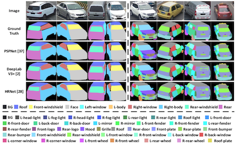

# parsing_platform
A pytorch codebase for human parsing and vehicle parsing.

## Introduction
A pytorch codebase for human parsing and vehicle parsing.

&ensp;&ensp;&ensp;&ensp;&ensp;&ensp;

## Requirements

- Linux or macOS with python ≥ 3.6
- PyTorch = 0.4.1
- torchvision that matches the Pytorch installation. You can install them together at [pytorch.org](https://pytorch.org/) to make sure of this.
- tensorboard (needed for visualization): `pip install tensorboard`

## Supported methods

- [x] PSPNet
- [x] DeepLabV3
- [x] CCNet
- [x] DANet
- [x] OCNet
- [x] CE2P
- [x] HRNet
- [x] BraidNet


## Supported datasets

- [x] Look-Into-Person [LIP](http://sysu-hcp.net/lip/)
- [x] Multi-grained Vehicle Parsing [MVP](https://xinchenliu.com/MVP.html)

## Model Zoo

**Models trained on the MVP dataset for vehicle parsing**:

| Method | Dataset | Pixel Acc | Mean Acc | mIoU | download |
| :---: | :---: | :---: |:---: | :---: |:---: |
| PSPNet | MVP-Coarse | 90.26% | 89.08% | 79.78% | [model](https://github.com/lxc86739795/parsing_platform/releases/download/v0.1/pspnet_mvp_coarse.pth) |
| PSPNet | MVP-Fine | 86.21% | 69.61% | 57.47% | [model](https://github.com/lxc86739795/parsing_platform/releases/download/v0.1/pspnet_mvp_fine.pth) |
| DeepLabV3 | MVP-Coarse | 90.55% | 89.45% | 80.04% | [model](https://github.com/lxc86739795/parsing_platform/releases/download/v0.1/deeplabv3_mvp_coarse.pth) |
| DeepLabV3 | MVP-Fine | 87.42% | 73.50% | 61.60% | [model](https://github.com/lxc86739795/parsing_platform/releases/download/v0.1/deeplabv3_mvp_fine.pth) |
| HRNet | MVP-Coarse | 90.40% | 89.36% | 68.5% | [model](https://github.com/lxc86739795/parsing_platform/releases/download/v0.1/hrnet_mvp_coarse.pth) |
| HRNet | MVP-Fine | 86.47% | 72.62% | 60.21% | [model](https://github.com/lxc86739795/parsing_platform/releases/download/v0.1/hrnet_mvp_fine.pth) |

\* The performance is evaluated on the test set.

\** The DeepLabV3 model is trained with cross-entropy + IoU loss.

## Citation
```BibTeX

@inproceedings{mm/LiuZLSM19,
  author    = {Xinchen Liu and
               Meng Zhang and
               Wu Liu and
               Jingkuan Song and
               Tao Mei},
  title     = {BraidNet: Braiding Semantics and Details for Accurate Human Parsing},
  booktitle = ACM MM,
  pages     = {338--346},
  year      = {2019}
}

@inproceedings{mm/LiuLZY020,
  author    = {Xinchen Liu and
               Wu Liu and
               Jinkai Zheng and
               Chenggang Yan and
               Tao Mei},
  title     = {Beyond the Parts: Learning Multi-view Cross-part Correlation for Vehicle
               Re-identification},
  booktitle = {ACM MM},
  pages     = {907--915},
  year      = {2020}
}
